# Remote collaborative work

## A practical introduction to `git`

by Guillaume Desforges
Data & Software Engineer @ [Tweag](https://tweag.io)

---

# Goals

* understand why it's important to use the right tools
* learn `git`'s model of collaboration
* master its most basic workflows

---

# Why?


---

# This year (and the next)

Work on text files

* code
* reports: TPs, projects, internships

---

# What's the matter?

* text content evolves with time
* real work requires collaboration

---

# Tracking changes: versioning

* cancel changes (rollback)
* work on different versions in parallel
* understand when and why something was changed

---

# Working together: collaboration

* make some modifications on one's own computer
* share their modification
* integrate others' modifications
* store all those modifications in one central place

---

# How to do all that?

* rollback to a previous version
* work on different versions in parallel
* share/get modifications with/from others

---

# The solution?


---

# `git` versioning model

## "How to version with `git`"

---

# Reminder: goals

* rollback to a previous **version**
* work on different **versions** in parallel
* share/get **modifications** with/from others

---

# What's a version?

## A version represents evolving content

Version `v1`

```
Hello world.
```

Version `v2`

```
Hello, world!
```

---

# Visualizing versions

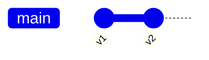

Version `v1` is followed by `v2`.

---

# A new version is "modifications from past version"

```diff
- Hello world.
+ Hello, world!
```

We call it a **diff**.

---

# What's a version?

* diff
* id of parent
* id (hash)
* additional data (date, author, description)

---

# This is a "**commit**"

<table style="text-align: center;">
  <tr style="background: #EEE;">
    <th colspan=3>commit</th>
  </tr>
  <tr style="background: white;">
    <td colspan=3>diff</td>
  </tr>
  <tr style="background: white;">
    <td colspan=3>hash</td>
  </tr>
  <tr style="background: white;">
    <td colspan=3>parent</td>
  </tr>
  <tr style="background: white;">
    <td>date</td>
    <td>author</td>
    <td>description</td>
  </tr>
</table>

---

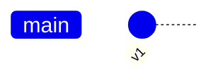

---


---

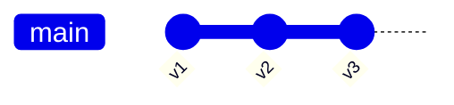

---

# How to create a commit

* using `git`
  * it's a command-line interface (CLI)
    ```
    git <command>
    ```
  * some visual tools exist
* before anything: `git init`

---

# How to compute the diff?

`git diff`

output:

```
diff --git a/song.txt b/hello.txt
index 18249f3..af5626b 100644
--- a/song.txt
+++ b/song.txt
@@ -1 +1 @@
-Hello world.
+Hello, world!
```

---

# How to create a commit

From version `v1`


`song.txt`:
```
Hello world.
```

---

# How to create a commit

Edit files

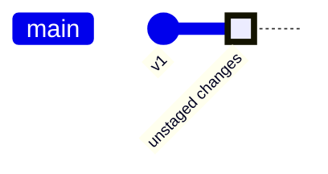

`song.txt`:

```
Hello, world!
```

---

# How to create a commit

Check current status with `git status`

output:

```
On branch main
Changes not staged for commit:
  (use "git add <file>..." to update what will be committed)
  (use "git restore <file>..." to discard changes in working directory)
        modified:   song.txt

no changes added to commit (use "git add" and/or "git commit -a")```
```

---

# How to create a commit

Add to index: `git add song.txt`

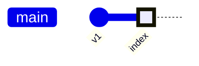

---

# How to create a commit

Check current status with `git status`

output:

```
$ git status
On branch main
Changes to be committed:
  (use "git restore --staged <file>..." to unstage)
        modified:   song.txt
```

---

# How to create a commit

Commit to a new version: `git commit -m "v2"`


---

# How to create a commit

* `git add song.txt`
* `git commit -m "v2"`
* tip: use `git status` often

---

# What happened?

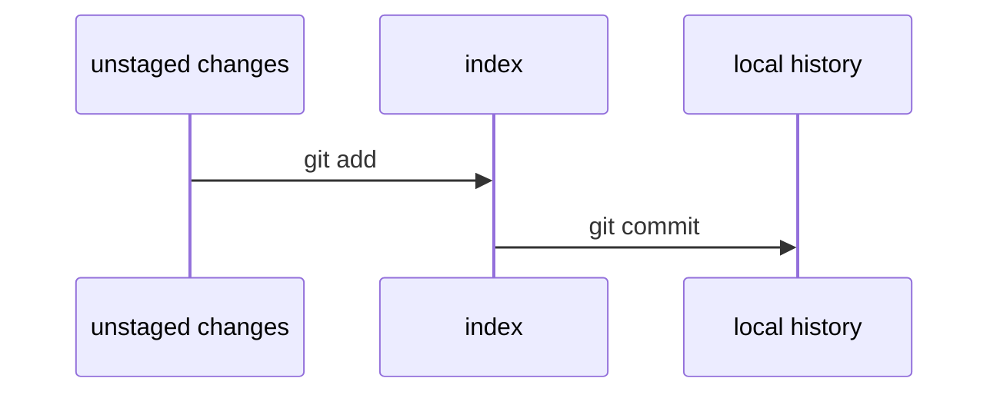

---

# Cancel current changes

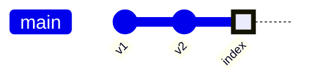

`git reset`


---

# Reset to another version


`git reset --hard v1`


It's like _deleting_ commits.

---

# Reset changes

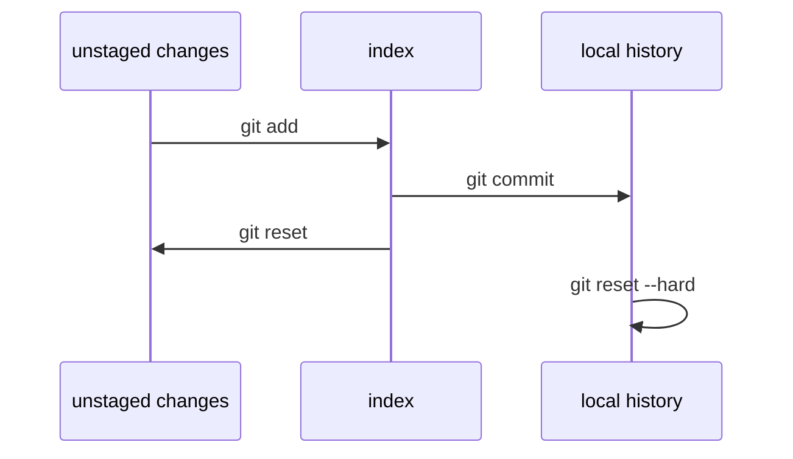

---

# Travel in the history

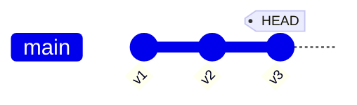

`git checkout v1`

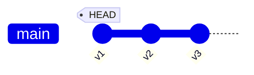

---

# Travel in the history


`git checkout main`


---

# Travel in the history

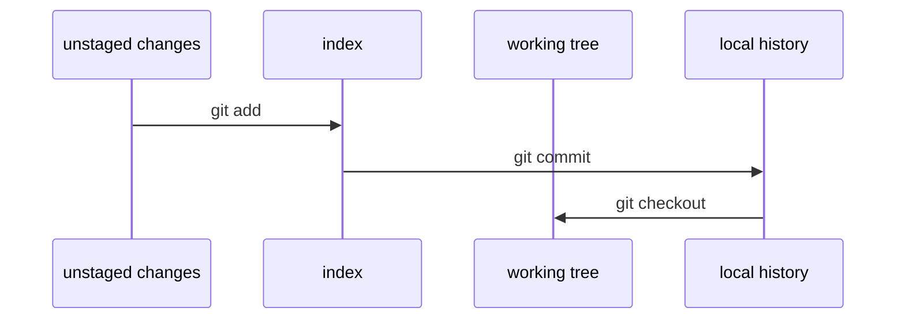

---

# Working in parallel

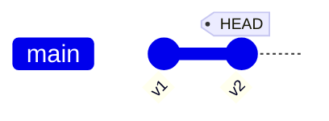

`git branch alternative`

```mermaid { style="height:200px;" }
    gitGraph
      commit id: "v1"
      commit id: "v2" tag: "HEAD"
      branch alternative
```

---

# Working in parallel

```mermaid { style="height:200px;" }
    gitGraph
      commit id: "v1"
      commit id: "v2" tag: "HEAD"
      branch alternative
```

`git checkout alternative`
`git commit -m "v3"`

```mermaid { style="height:200px;" }
    gitGraph
      commit id: "v1"
      commit id: "v2"
      branch alternative
      commit id: "v3" tag: "HEAD"
```

---

# Working in parallel

```mermaid { style="height:200px;" }
    gitGraph
      commit id: "v1"
      commit id: "v2"
      branch alternative
      commit id: "v3" tag: "HEAD"
```

`git checkout main`

```mermaid { style="height:200px;" }
    gitGraph
      commit id: "v1"
      commit id: "v2" tag: "HEAD"
      branch alternative
      checkout alternative
      commit id: "v3"
      checkout main
```

---

# Working in parallel

```mermaid { style="height:200px;" }
    gitGraph
      commit id: "v1"
      commit id: "v2" tag: "HEAD"
      branch alternative
      checkout alternative
      commit id: "v3"
      checkout main
```

`git commit -m "v4"`

```mermaid { style="height:200px;" }
    gitGraph
      commit id: "v1"
      commit id: "v2"
      branch alternative
      checkout alternative
      commit id: "v3"
      checkout main
      commit id: "v4" tag: "HEAD"
```

---

# Working in parallel

```mermaid { style="height:200px;" }
    gitGraph
      commit id: "v1"
      commit id: "v2"
      branch alternative
      checkout alternative
      commit id: "v3"
      checkout main
      commit id: "v4" tag: "HEAD"
```

`git checkout alternative`
`git commit -m "v5"`

```mermaid { style="height:200px;" }
    gitGraph
      commit id: "v1"
      commit id: "v2"
      branch alternative
      checkout alternative
      commit id: "v3"
      checkout main
      commit id: "v4"
      checkout alternative
      commit id: "v5" tag: "HEAD"
```

---

# Merging branches

```mermaid { style="height:200px;" }
    gitGraph
      commit id: "v1"
      commit id: "v2"
      branch alternative
      checkout alternative
      commit id: "v3"
      checkout main
      commit id: "v4"
      checkout alternative
      commit id: "v5" tag: "HEAD"
```

`git checkout main`
`git merge alternative`

```mermaid { style="height:200px;" }
    gitGraph
      commit id: "v1"
      commit id: "v2"
      branch alternative
      checkout alternative
      commit id: "v3"
      checkout main
      commit id: "v4"
      checkout alternative
      commit id: "v5"
      checkout main
      merge alternative
      commit id: "v6" tag: "HEAD"
```

---

# What if they are not compatible?

<div style="display: flex; flex-direction: row;">
<div style="flex-grow: 1; padding: 1em;">

From `v1` to `v4`

```diff
- Hello world.
+ Never gonna give you up
```

From `v1` to `v5`

```diff
- Hello world.
+ Never gonna let you down
```

From `v1` to `v6` (merged)

```diff
- Hello world.
+ Never gonna give you up nor let you down
```

* It is called a **conflict**

</div>
<div style="flex-grow: 1; padding: 1em; display: flex; flex-direction: row; align-items: center;">

<div style="flex-grow: 1;">

```mermaid { style="height:300px;" }
    gitGraph
      commit id: "v1"
      commit id: "v2"
      branch alternative
      checkout alternative
      commit id: "v3"
      checkout main
      commit id: "v4"
      checkout alternative
      commit id: "v5"
      checkout main
      merge alternative
      commit id: "v6" tag: "HEAD"
```

</div>

</div>
</div>

---

# What if they are not compatible?

- It is called a **conflict**
* Practical session will cover how to handle it
* `git` was _made_ to handle conflicts properly, it's its strength: don't dodge it!

---

# What if they are not compatible?

How it looks like

```diff
$ git merge alternative 
Auto-merging song.txt
CONFLICT (content): Merge conflict in song.txt
Automatic merge failed; fix conflicts and then commit the result.

$ cat song.txt 
<<<<<<< HEAD
Never gonna give you up
=======
Never gonna let you down
>>>>>>> alternative
```

---

# Recap

* _modifications_ of content is a **diff**
* create **commits** to keep track of _versions_ progressively
* use **branches** to work on _alternative histories_
* **merge** two branches to _merge both histories_ together

---

# `git` collaboration workflow

## "How to collaborate using `git`"

---

# Collaboration

* Working on the same text
* Working from different computers
* Keeping a common shared history to make progress together

---

# What we _don't_ want

```mermaid { style="height:200px;" }
    gitGraph
      commit id: "v1"
      branch Will
      commit id: "v2-will"
      checkout main
      branch Sarah
      commit id: "v2-sarah"
      checkout Will
      commit id: "v3-will"
      checkout Sarah
      commit id: "v3-sarah"
```

---

# What we want

```mermaid { style="height:200px;" }
    gitGraph
      checkout main
      commit id: "v1"
      branch Will
      branch Sarah
```

---

# What we want

```mermaid { style="height:200px;" }
    gitGraph
      checkout main
      commit id: "v1"
      branch Will
      checkout Will
      commit id: "v2-will"
```

---

# What we want

```mermaid { style="height:200px;" }
    gitGraph
      checkout main
      commit id: "v1"
      branch Will
      checkout Will
      commit id: "v2-will"
      checkout main
      branch Sarah
      checkout Sarah
      commit id: "v2-sarah"
```

---

# What we want

```mermaid { style="height:200px;" }
    gitGraph
      checkout main
      commit id: "v1"
      branch Will
      checkout Will
      commit id: "v2-will"
      checkout main
      branch Sarah
      checkout Sarah
      commit id: "v2-sarah"
      checkout Will
      commit id: "v3-will"
```

---

# What we want

```mermaid { style="height:200px;" }
    gitGraph
      checkout main
      commit id: "v1"
      branch Will
      checkout Will
      commit id: "v2-will"
      checkout main
      branch Sarah
      checkout Sarah
      commit id: "v2-sarah"
      checkout Will
      commit id: "v3-will"
      checkout main
      merge Will
      commit id: "v3"
```

---

# What we want

```mermaid { style="height:200px;" }
    gitGraph
      checkout main
      commit id: "v1"
      branch Will
      checkout Will
      commit id: "v2-will"
      checkout main
      branch Sarah
      checkout Sarah
      commit id: "v2-sarah"
      checkout Will
      commit id: "v3-will"
      checkout main
      merge Will
      commit id: "v3"
      checkout Sarah
      merge main
      commit id: "v4-sarah"
```

---

# What we want

```mermaid { style="height:200px;" }
    gitGraph
      checkout main
      commit id: "v1"
      branch Will
      checkout Will
      commit id: "v2-will"
      checkout main
      branch Sarah
      checkout Sarah
      commit id: "v2-sarah"
      checkout Will
      commit id: "v3-will"
      checkout main
      merge Will
      commit id: "v3"
      checkout Sarah
      merge main
      commit id: "v4-sarah"
      checkout main
      merge Sarah
      commit id: "v4"
```

---

# But those are local branches, aren't they?

* Previous graph is an illustration with local branches
* But using branches is exactly what we are going to do!
* We just need to talk about the **remote**

---

# Introducing **remotes**

## Goals

* share changes from one's computer to others'
* receive changes from others' to one's computer

---

# Introducing **remotes**

```mermaid { style="height:400px;" }
flowchart LR
    remote((GitHub)) <--> will[Will]
    remote <--> sarah[Sarah]
```

---

# Local history vs remote history

## Recap: data structures so far

* **branch** = set of commits
* **history** = set of branches

---

# Local history vs remote history

## What is stored?

Remote or local store a whole _history_.

---

# Local history vs remote history

## Where is it stored?

* Local: on your computer
* Remote: on a server provided by a service (e.g. GitHub, GitLab, Bitbucket, ...)

---

# Local history vs remote history

## What do they mean?

* Remote: the single source of truth for everyone
* Local: a copy you can work on

---

# The workflow

Remote:

```mermaid { style="height:80px;" }
    gitGraph
      checkout main
```

Will:

```mermaid { style="height:80px;" }
    gitGraph
      checkout main
```

Sarah:

```mermaid { style="height:80px;" }
    gitGraph
      checkout main
```

---

# The workflow

```
will: git commit -m "v1-will"
```

Remote:

```mermaid { style="height:80px;" }
    gitGraph
      checkout main
```

Will:

```mermaid { style="height:80px;" }
    gitGraph
      checkout main
      commit id: "v1-will"
```

Sarah:

```mermaid { style="height:80px;" }
    gitGraph
      checkout main
```

---

# The workflow

```
will: git push
```

Remote:

```mermaid { style="height:80px;" }
    gitGraph
      checkout main
      commit id: "v1-will"
```

Will:

```mermaid { style="height:80px;" }
    gitGraph
      checkout main
      commit id: "v1-will"
```

Sarah:

```mermaid { style="height:80px;" }
    gitGraph
      checkout main
```

---

# The workflow

```
sarah: git pull
```

Remote:

```mermaid { style="height:80px;" }
    gitGraph
      checkout main
      commit id: "v1-will"
```

Will:

```mermaid { style="height:80px;" }
    gitGraph
      checkout main
      commit id: "v1-will"
```

Sarah:

```mermaid { style="height:80px;" }
    gitGraph
      checkout main
      commit id: "v1-will"
```

---

# The workflow

```
will: git commit -m "v2-will"
```

Remote:

```mermaid { style="height:80px;" }
    gitGraph
      checkout main
      commit id: "v1-will"
```

Will:

```mermaid { style="height:80px;" }
    gitGraph
      checkout main
      commit id: "v1-will"
      commit id: "v2-will"
```

Sarah:

```mermaid { style="height:80px;" }
    gitGraph
      checkout main
      commit id: "v1-will"
```

---

# The workflow

```
sarah: git commit -m "v2-sarah"
```

Remote:

```mermaid { style="height:80px;" }
    gitGraph
      checkout main
      commit id: "v1-will"
```

Will:

```mermaid { style="height:80px;" }
    gitGraph
      checkout main
      commit id: "v1-will"
      commit id: "v2-will"
```

Sarah:

```mermaid { style="height:80px;" }
    gitGraph
      checkout main
      commit id: "v1-will"
      commit id: "v2-sarah"
```

---

# The workflow

```
will: git commit -m "v3-will"
```

Remote:

```mermaid { style="height:80px;" }
    gitGraph
      checkout main
      commit id: "v1-will"
```

Will:

```mermaid { style="height:80px;" }
    gitGraph
      checkout main
      commit id: "v1-will"
      commit id: "v2-will"
      commit id: "v3-will"
```

Sarah:

```mermaid { style="height:80px;" }
    gitGraph
      checkout main
      commit id: "v1-will"
      commit id: "v2-sarah"
```

---

# The workflow

```
will: git push
```

Remote:

```mermaid { style="height:80px;" }
    gitGraph
      checkout main
      commit id: "v1-will"
      commit id: "v2-will"
      commit id: "v3-will"
```

Will:

```mermaid { style="height:80px;" }
    gitGraph
      checkout main
      commit id: "v1-will"
      commit id: "v2-will"
      commit id: "v3-will"
```

Sarah:

```mermaid { style="height:80px;" }
    gitGraph
      checkout main
      commit id: "v1-will"
      commit id: "v2-sarah"
```

---

# The workflow

```
sarah: git pull
-> CONFLICT!
```

Remote:

```mermaid { style="height:80px;" }
    gitGraph
      checkout main
      commit id: "v1-will"
      commit id: "v2-will"
      commit id: "v3-will"
```

Sarah:

```mermaid { style="height:80px;" }
    gitGraph
      checkout main
      commit id: "v1-will"
      commit id: "v2-sarah"
```

---

# The workflow

```
sarah: git pull
-> CONFLICT!
```

Sarah:

<!-- can't rename main branch because we render mermaid using kroki -->
<!-- https://github.com/yuzutech/kroki/issues/1326 "Set mermaid configuration" -->
```mermaid { style="height:200px;" }
    gitGraph
      commit id: "v1-will"
      branch sarah/main
      checkout main
      commit id: "v2-will"
      checkout sarah/main
      commit id: "v2-sarah"
      checkout main
      commit id: "v3-will"
```

---

# The workflow

```
sarah: Solve conflicts
```

Sarah:

<!-- can't rename main branch because we render mermaid using kroki -->
<!-- https://github.com/yuzutech/kroki/issues/1326 "Set mermaid configuration" -->
```mermaid { style="height:200px;" }
    gitGraph
      commit id: "v1-will"
      branch sarah/main
      checkout main
      commit id: "v2-will"
      checkout sarah/main
      commit id: "v2-sarah"
      checkout main
      commit id: "v3-will"
      checkout sarah/main
      merge main
      commit id: "v4-sarah"
```

---

# The workflow

```
sarah: git push
```

Remote:

```mermaid { style="height:80px;" }
    gitGraph
      commit id: "v1-will"
      branch sarah/main
      checkout main
      commit id: "v2-will"
      checkout sarah/main
      commit id: "v2-sarah"
      checkout main
      commit id: "v3-will"
      checkout sarah/main
      merge main
      checkout main
      merge sarah/main
      commit id: "v4-sarah"
```

Will:

```mermaid { style="height:80px;" }
    gitGraph
      checkout main
      commit id: "v1-will"
      commit id: "v2-will"
      commit id: "v3-will"
```

Sarah:

<!-- can't rename main branch because we render mermaid using kroki -->
<!-- https://github.com/yuzutech/kroki/issues/1326 "Set mermaid configuration" -->
```mermaid { style="height:140px;" }
    gitGraph
      commit id: "v1-will"
      branch sarah/main
      checkout main
      commit id: "v2-will"
      checkout sarah/main
      commit id: "v2-sarah"
      checkout main
      commit id: "v3-will"
      checkout sarah/main
      merge main
      commit id: "v4-sarah"
```

---

# The workflow

```
will: git pull
```

Remote:

```mermaid { style="height:80px;" }
    gitGraph
      commit id: "v1-will"
      branch sarah/main
      checkout main
      commit id: "v2-will"
      checkout sarah/main
      commit id: "v2-sarah"
      checkout main
      commit id: "v3-will"
      checkout sarah/main
      merge main
      checkout main
      merge sarah/main
      commit id: "v4-sarah"
```

Will:

```mermaid { style="height:80px;" }
    gitGraph
      commit id: "v1-will"
      branch sarah/main
      checkout main
      commit id: "v2-will"
      checkout sarah/main
      commit id: "v2-sarah"
      checkout main
      commit id: "v3-will"
      checkout sarah/main
      merge main
      checkout main
      merge sarah/main
      commit id: "v4-sarah"
```

Sarah:

<!-- can't rename main branch because we render mermaid using kroki -->
<!-- https://github.com/yuzutech/kroki/issues/1326 "Set mermaid configuration" -->
```mermaid { style="height:140px;" }
    gitGraph
      commit id: "v1-will"
      branch sarah/main
      checkout main
      commit id: "v2-will"
      checkout sarah/main
      commit id: "v2-sarah"
      checkout main
      commit id: "v3-will"
      checkout sarah/main
      merge main
      commit id: "v4-sarah"
```

---

# Recap

* collaboration is centralized using a **remote**
* it stores a _history_
* it acts as a _single source of truth_
* you share by *pushing/pulling a branch*

---

# Pitfalls

* don't diverge, merge often
* conflicts _will_ happen, **solve them**!

---

# All in all

* Using git we will
  * keep track of your changes progressively
  * collaborate
